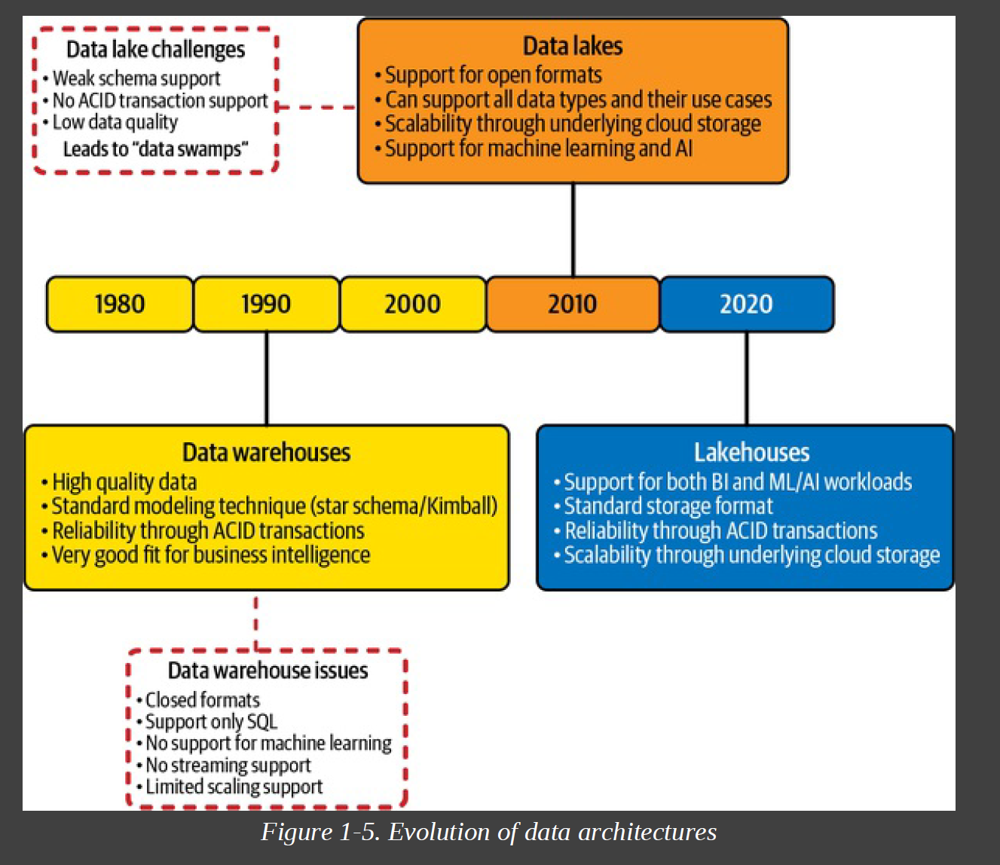
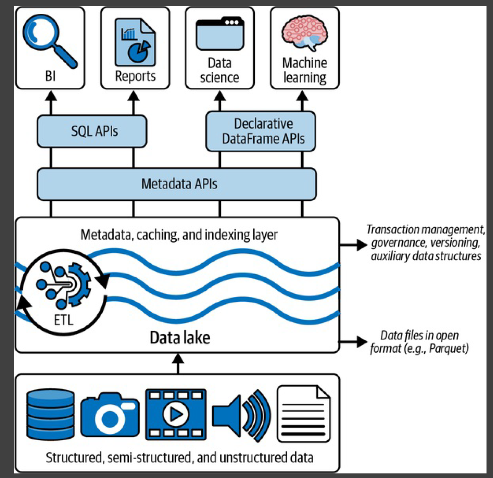
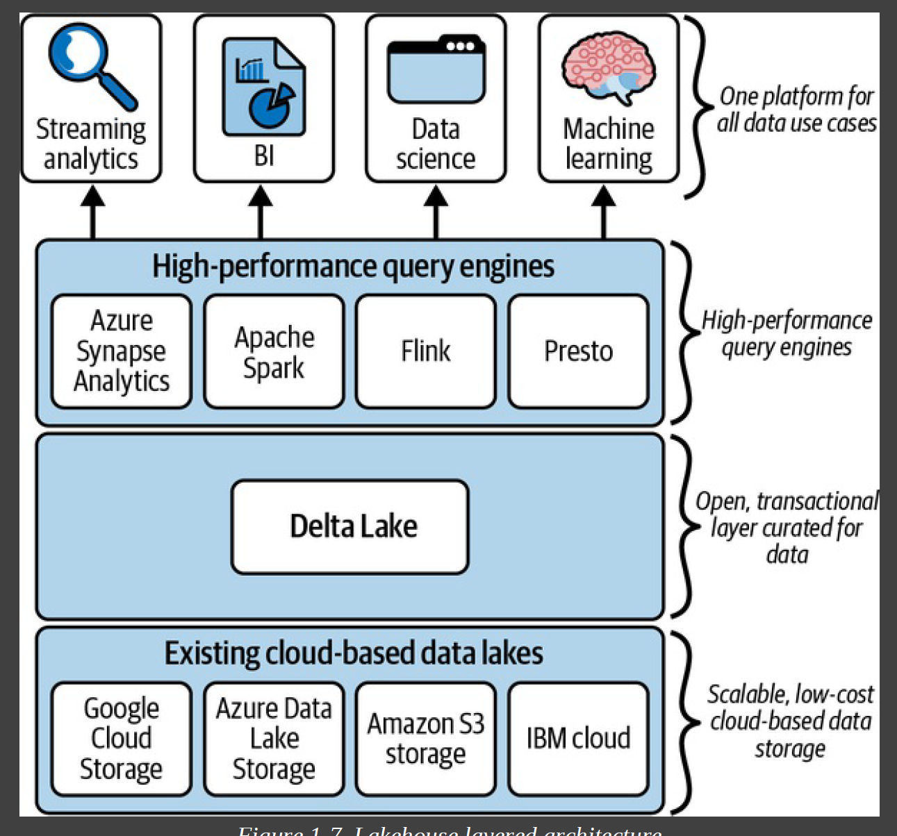
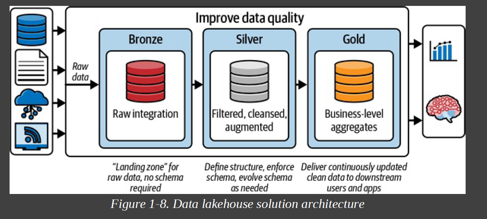

# summary and notes from pdf files

## Implementing a Lakehouse
As we mentioned earlier, lakehouses leverage low-cost object stores, like Amazon S3, ADLS, or GCS, storing the data in an open source table format, such as Apache Parquet. However, since lakehouse implementations run ACID transactions against this data, we need a transactional metadata layer on top of the cloud storage, defining which objects are part of the table version.

In Spark, the DataFrame API is declarative, and lazy evaluation is used to build an execution DAG (directed acyclic graph). This graph can then be optimized before any action consumes the underlying data in the DataFrame. This gives the lakehouse several new optimization features, such as caching and auxiliary data. Figure 1-6 shows how these requirements fit into an overall lakehouse system design

## What is [Delta Lake](https://delta.io)

Delta Lake is an open-table format that combines metadata, caching, and indexing with a data lake storage format. Together these provide an abstraction level to serve ACID transactions and other management features.

Delta Lake provides :

- ACID transactions
- scalable metadata handling
- a unified process model that spans batch and streaming
- full audit history
- support for SQL data manipulation language (DML) statements. 

It can run on existing data lakes and is fully compatible with several processing engines, including Apache Spark.

## Lakehouse architecture

## The Medallion Architecture

# Page 32 du doc