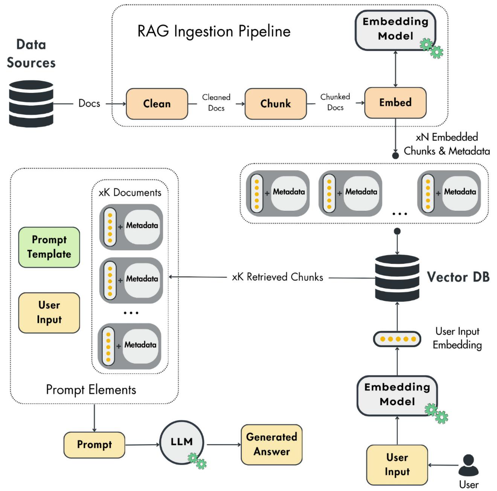
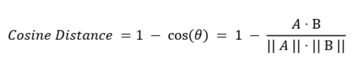

[github link](https://github.com/PacktPublishing/LLM-Engineers-Handbook?tab=readme-ov-file)

## RAG

A RAG system is composed of three main modules independent of each other:

- Ingestion pipeline: A batch or streaming pipeline used to populate the vector DB
- Retrieval pipeline: A module that queries the vector DB and retrieves relevant entries to the user’s input
- Generation pipeline: The layer that uses the retrieved data to augment the prompt and an LLM to generate answers

- On the client side, the user asks a question.
- The question is passed to the retrieval module, which preprocesses the user’s input and queries the vector DB.
- The generation pipelines use a prompt template, user input, and retrieved context to create the prompt.
- The prompt is passed to an LLM to generate the answer.
- The answer is shown to the user.

### Ingestion Pipeline

 chunking is required to separate specific regions that are semantically related. For example, when chunking a book’s chapter, the most optimal way is to group similar paragraphs into the same section or chunk. By doing so, at the retrieval time, you will add only the essential data to the prompt.

 The embedding component uses anembedding model to take the chunk’s content (text, images, audio, etc.) and project it into a dense vector packed with semantic value

 The loading module takes the embedded chunks along with a metadata document. The metadata will contain essential information such as the embedded content, the URL to the source of the chunk, and when the content was published on the web. The embedding is used as an index to query similar chunks, while the metadata is used to access the information added to augment the prompt.

### Retrieval Pipeline

You must use a distance metric to compare two vectors, such as the Euclidean or Manhattan distance. But the most popular one is the cosine distance, which is equal to 1 minus the cosine of the angle between two vectors, as follows:

-1 : Vectors on opposite directions, 0 : Vectors are orthogonal

Most of the time, the cosine distance works well in non-linear complex vector spaces. However, it is essential to notice that choosing the proper distance between two vectors depends on your data and the embedding model you use.

### Generation Pipeline

#### What are embeddings ?

[Umap](https://umap-learn.readthedocs.io/en/latest/index.html)

#### Curse of dimensionality

You can use embeddings to encode any categorical variable and feed it to an ML model. But why not use other simple methods, such as one-hot encoding? When working with categorical variables with high cardinality, such as language vocabularies, you will suffer from the curse of dimensionality when using other classical methods. For example, if your vocabulary has 10,000 tokens, then only one token will have a length of 10,000 after applying one-hot encoding. If the input sequence has N tokens, that will become N * 10,000 input parameters. If N >= 100, often, when inputting text, the input is too large to be usable. Another issue with other classical methods that don’t suffer from the curse of dimensionality, such as hashing, is that you lose the semantic relationships between the vectors.

One-hot encoding is a technique that converts categorical variables into a binary matrix representation. Each category is represented as a unique binary vector. For each categorical variable, a binary vector is created with a length equal to the number of unique categories, where all values are zero except for the index corresponding to the specific category, which is set to one. The method preserves all information about the categories. It is simple and interpretable. However, a significant disadvantage is that it can lead to a high-dimensional feature space if the categorical variable has many unique values, making the method impractical.

### Creatin Embeddings

Embeddings are created by deep learning models that understand the context and semantics of your input and project it into a continuous vector space.