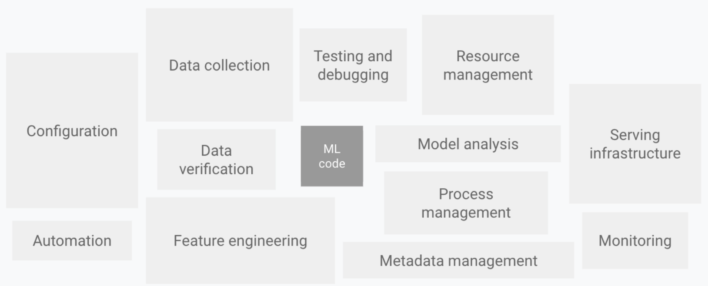
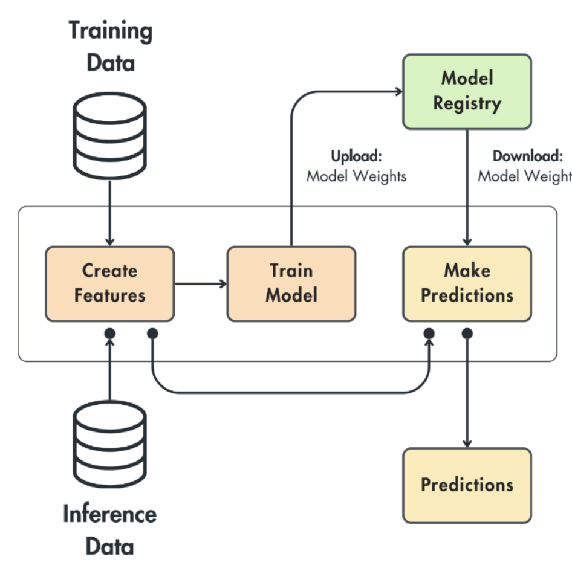
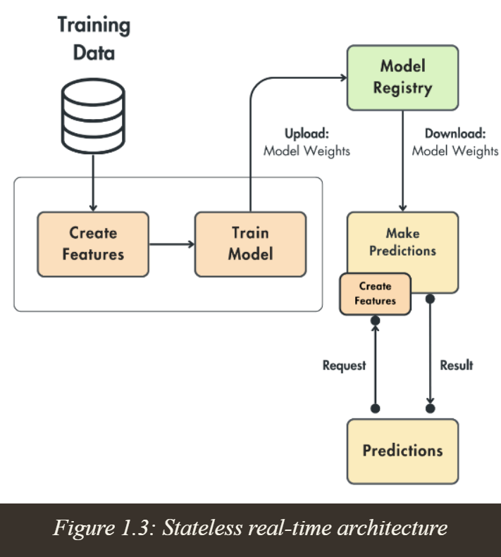
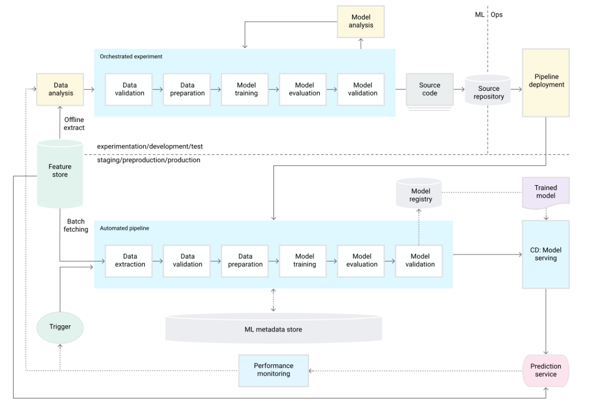
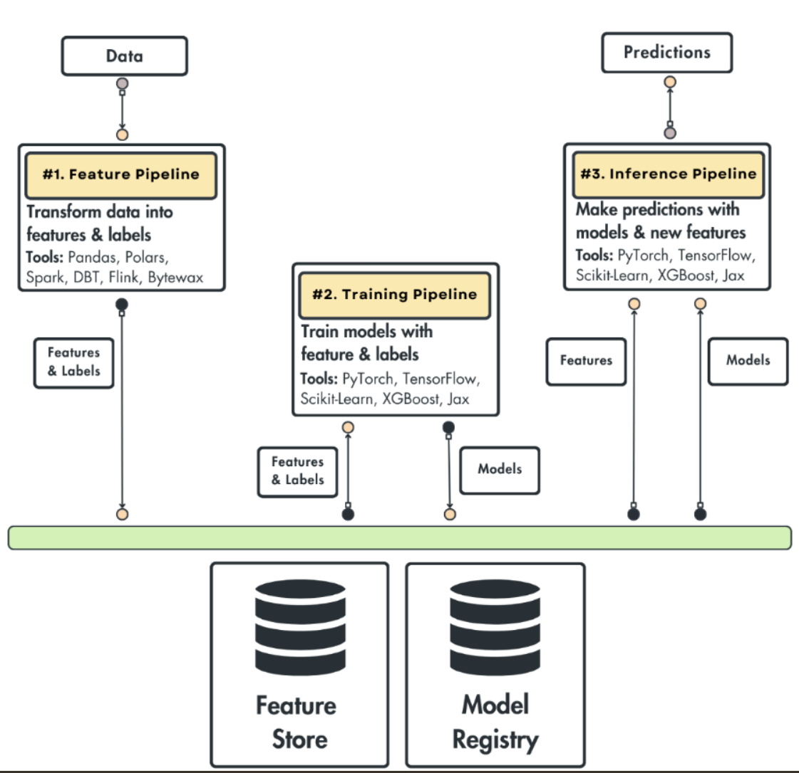

## The process for a LLM Twin

The solution is to build an LLM system that encapsulates and automates all the following steps : 

- data collection
- data preprocessing
- data storage, versioning, and retrieval
- LLM fine-tuning
- RAG

Let's be LLM agnostic

Dans MVP, V is essential :  The product must provide an end-to-end user journey without half-implemented features.

##  feature/training/inference (FTI) architecture

Suggested by Google Cloud team.

Monolitic batch pipeline architecture drawbacks

- features are not reusable (by your system or others)
- if the data increases, you have to refactor the whole code to support PySpark or Ray
- hard to rewrite the prediction module in a more efficient language such as C++, Java or Rust
- hard to share the work between multiple teams between the features, training, and prediction modules
- impossible to switch to a streaming technology for real-time training

In this case, we have also to transfer the whole state through the client request so the features can be computed and passed to the model

Another example would be when implementing an LLM with RAG support. The documents we add as context along the query represent our external state. If we didn't store the records in a vector DB, we would have to pass them with the user query. To do so, the client must know how to query and retrieve the documents, which is not feasible. It is an antipattern for the client application to know how to access or compute the features.

 You will have difficulty understanding if you are not highly experienced in deploying and keeping ML models in production. Also, it is not straightforward to understand how to start small and grow the system in time.

 [link to Google](https://cloud.google.com/architecture/mlops-continuous-delivery-and-automation-pipelines-in-machine-learning)

## The solution: ML pipelines for ML systems

Based on these three critical steps that any ML system requires, the pattern is known as the FTI (feature, training, inference) pipelines. So, how does this differ from what we presented before?

The pattern suggests that any ML system can be boiled down to these three pipelines: feature, training, and inference (similar to the database, business logic and UI layers from classic software).

To boile down: réduire

Modèle (Model) : La couche qui gère la logique métier et les données de l'application, similaire à ce qui est décrit comme "business logic" dans la phrase.
Vue (View) : La couche responsable de l'interface utilisateur, correspondant ici à "UI layers".
Contrôleur (Controller) : La couche intermédiaire qui gère les interactions entre la Vue et le Modèle

### The feature pipeline 

takes raw data as input, processes it, and outputs the features and labels required by the model for training or inference

Le pipeline de fonctionnalités prend des données brutes en entrée, les traite et produit les caractéristiques et les étiquettes nécessaires au modèle pour l'entraînement ou l'inférence.

By saving the features into a feature store, we always have a state of our features. Thus, we can easily send the features to the training and inference pipeline(s).

As the data is versioned, we can always ensure that the training and inference time features match. Thus, we avoid the training-serving skew problem.

Le training-serving skew est un problème qui survient lorsque les données ou les caractéristiques utilisées lors de l'entraînement diffèrent de celles utilisées en production (inférence), ce qui peut causer des erreurs ou diminuer la performance du modèle. En versionnant les données, on minimise ce risque, car on sait que les caractéristiques resteront identiques dans les deux phases.

### The training pipeline 

takes the features and labels from the features store as input and outputs a train model or models. The models are stored in a model registry. Its role is similar to that of feature stores, but this time, the model is the first-class citizen. Thus, the model registry will store, version, track, and share the model with the inference pipeline

### The inference pipeline 

takes as input the features & labels from the feature store and the trained model from the model registry. With these two, predictions can be easily made in either batch or real-time mode.

As this is a versatile pattern, it is up to you to decide what you do with your predictions. If it's a batch system, they will probably be stored in a database. If it's a real-time system, the predictions will be served to the client who requested them. Additionally, as the features, labels, and model are versioned. We can easily upgrade or roll back the deployment of the model. For example, we will always know that model v1 uses features F1, F2, and F3, and model v2 uses F2, F3, and F4. Thus, we can quickly change the connections between the model and features

### Summary

The feature pipeline takes in data and outputs features & labels saved to the feature store.
The training pipelines query the features store for features & labels and output a model to the model registry.
The inference pipeline uses the features from the feature store and the model from the model registry to make predictions.

The final thing you must understand about the FTI pattern is that the system doesn't have to contain only three pipelines. In most cases, it will include more. For example, the feature pipeline can be composed of a service that computes the features and one that validates the data. Also, the training pipeline can be composed of the training and evaluation components.

The FTI pipelines act as logical layers. Thus, it is perfectly fine for each to be complex and contain multiple services. However, what is essential is to stick to the same interface on how the FTI pipelines interact with each other through the feature store and model registries. By doing so, each FTI component can evolve differently, without knowing the details of each other and without breaking the system on new changes.

learn more about the features/training/inference pipeline pattern, consider reading this article by Jim Dowling, CEO and Co-Founder at Hopsworks: From MLOps to ML Systems with Feature/Training/Inference Pipelines.

## Designing the system architecture of the LLM Twin

We only want to define a high-level architecture of the system, which is language-, framework-, platform-, and infrastructure-agnostic at this point

