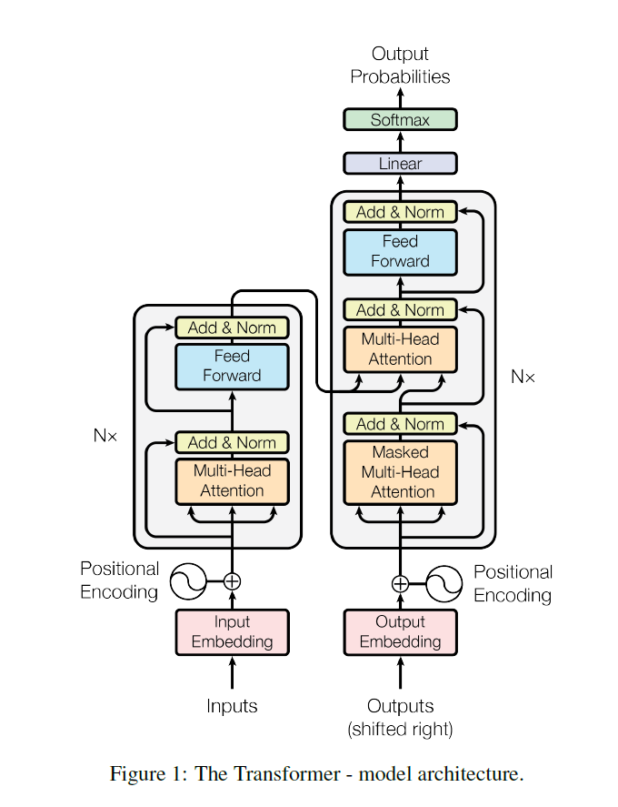

# chapter 1

[Start here](https://github.com/mlabonne/llm-course)

Autoregressive : they generate the next tokens based on the sequence of tokens already generated

Attention mechanism : establishing word connections and ensures the text is coherent and contextually appropriate

## Recurrent Neural Networks (RNNs) and the vanishing gradient problem

1. **Difficulté avec les séquences longues** : Les RNNs tendent à "oublier" les informations anciennes au profit des informations récentes dans la séquence. Cela signifie que, plus la séquence est longue, plus le réseau a du mal à se souvenir des éléments en début de séquence.

2. **Cause principale : le problème de gradient évanescent** : Ce phénomène se produit lors de l'entraînement du réseau. Pendant le processus de rétropropagation, qui permet d'ajuster les poids du réseau pour minimiser l'erreur, les gradients (les valeurs qui déterminent la correction à appliquer) deviennent de plus en plus petits à mesure qu'ils sont propagés à travers chaque étape temporelle de la séquence.

3. **Effet du gradient évanescent** : Lorsque les gradients deviennent très faibles, les mises à jour des poids deviennent négligeables pour les premières parties de la séquence. Cela empêche le réseau de "retenir" efficacement des informations des premiers éléments de la séquence et limite sa capacité à capturer des dépendances à long terme.

C'est pourquoi des architectures comme les LSTM (Long Short-Term Memory) ou GRU (Gated Recurrent Unit) ont été introduites pour pallier cette limitation, en ajoutant des mécanismes permettant de mieux conserver des informations sur des périodes plus longues.

Transformer-based models addressed these challenges and
emerged as the preferred architecture for natural language
processing tasks. This architecture introduced in the
influential paper [Attention Is All You Need](https://arxiv.org/pdf/1706.03762)

## Decoder only 

Les modèles comme LLaMA utilisent une architecture de type "decoder-only" (uniquement décodeur), mais cela ne signifie pas qu'ils ne peuvent pas encoder une phrase. Voici comment ils fonctionnent pour traiter une entrée :

1. **Encodage des tokens** : Tout d'abord, l'entrée (la phrase) est divisée en unités appelées tokens, qui sont des sous-mots ou mots entiers, selon la méthode de tokenisation. Chaque token est ensuite converti en vecteur numérique par une étape d'embedding (représentation vectorielle). Cela transforme le texte d'entrée en une séquence de vecteurs numériques que le modèle peut traiter.

2. **Auto-régression** : Dans une architecture "decoder-only", l'attention est auto-régressive, ce qui signifie que chaque token est traité en fonction des tokens précédents, et non des suivants. Cette attention masque les futurs tokens pour que chaque token "ne regarde" que ce qui le précède, imitant un processus de génération étape par étape.

3. **Empilement des couches de transformeur** : Le modèle est constitué de plusieurs couches de transformeur, qui traitent cette séquence de vecteurs. Chaque couche applique une attention multi-tête et des transformations linéaires pour produire des représentations de plus en plus complexes de la séquence d’entrée. Bien que le modèle soit un décodeur, ces couches d'attention permettent de capturer et de "coder" le contexte de la phrase d'entrée.

4. **Représentation finale** : Une fois que tous les tokens de la phrase ont été traités, chaque token dans la séquence contient une représentation encodée du contexte global (dans la mesure où il s’agit des tokens précédents). Pour des tâches de génération, le modèle utilise la dernière représentation pour prédire le token suivant. Pour d’autres types de tâches (comme la classification de séquence), le modèle peut utiliser la représentation d’un token spécial (par exemple, celui qui marque le début de la séquence) pour résumer l’ensemble de la phrase.

En résumé, même s'il s'agit d'un modèle de type "decoder-only", le modèle peut encore "encoder" une phrase grâce aux mécanismes d’attention et aux représentations vectorielles des tokens, mais il le fait de manière auto-régressive. Il utilise le contexte des tokens précédents pour créer une représentation riche de l'entrée.

## Tokenization

The tokenization process is model-dependent

Advanced techniques, like the Byte-Pair encoding

Le Byte-Pair Encoding (BPE) est une technique de tokenisation sous-mot (subword tokenization). Dans le contexte du traitement du langage naturel, BPE est utilisé pour diviser les mots en unités plus petites (souvent appelées "sous-mots" ou "subwords"), ce qui aide le modèle à traiter des mots rares, des mots inconnus et des variations morphologiques.

Voici comment fonctionne BPE en tant que technique de tokenisation sous-mot :

1. **Décomposition en caractères** : Au début, chaque mot est représenté comme une séquence de caractères individuels, ce qui permet de créer un vocabulaire minimal.

2. **Fusion des paires de caractères** : Ensuite, la méthode identifie les paires de caractères qui apparaissent le plus fréquemment dans le texte d’entraînement et les fusionne en nouvelles unités. Ce processus est répété de manière itérative pour former des sous-mots de plus en plus longs.

3. **Formation d'un vocabulaire de sous-mots** : Ce processus de fusion continue jusqu'à ce que le vocabulaire atteigne une taille définie, contenant des unités qui sont souvent plus petites que des mots mais plus grandes que des caractères individuels. Le vocabulaire final contient donc des sous-mots, des racines communes et des affixes (préfixes, suffixes), permettant une représentation flexible.

4. **Avantages de la tokenisation sous-mot** : La tokenisation sous-mot comme BPE permet au modèle de traiter de manière efficace les mots rares ou nouveaux, car il peut les diviser en sous-mots existants dans le vocabulaire. Par exemple, le modèle peut traiter "running" comme "run" et "ning" si "running" ne figure pas dans le vocabulaire. Cela aide à réduire la taille du vocabulaire et à augmenter la généralisation.

BPE est largement utilisé dans les modèles de langage modernes, notamment dans les modèles de type transformeur, car il offre un bon équilibre entre la gestion des mots rares et la réduction de la taille du vocabulaire.

## NExt step : Embedding

## Training / Fine-Tuning 

https://commoncrawl.org/

After pre-training, the model typically undergoes fine-tuning
for a specific task. This stage requires further training on a
smaller dataset for a task (e.g., text translation) or a
specialized domain (e.g., biomedical, finance, etc.)

## Context size 

4o :  4,096 tokens
OpenAI's GPT-4-turbo-32k (with a 32,768-token context) 
OpenAI o1-preview model features a context window of 128,000 tokens

## Scaling Laws

language model’s performance 

Factors : 

1. The number of parameters (N) denotes the model’s
ability to learn from data. A greater number of
parameters enables the detection of more
complicated patterns in data.
2. The size of the Training Dataset (D) and the number
of tokens, ranging from small text chunks to single
characters, are counted.
3. FLOPs (Floating Point Operations Per Second)
estimate the computational resources used during
training.

[Chincchilla model](https://arxiv.org/abs/2203.15556)

N:70B, D:1,4T -> for a model with X parameters, the optimal training involves approximately X * 20 tokens

## Emergent Abilities in LLMs

## Evaluation Benchmarks for Emergent Abilities

- [BIG-Bench](https://github.com/google/BIG-bench/blob/main/bigbench/benchmark_tasks/README.md)
- [TruthfulQ](https://github.com/sylinrl/TruthfulQA)
- the Massive Multi-task Language Understanding ([MMLU](https://arxiv.org/abs/2009.03300))
- the Word in Context ([WiC](https://arxiv.org/abs/1808.09121v3))
- [WinoBias](http://uclanlp.github.io/corefBias/)

## Optimization Techniques to Expand the Context Window

ALiBi Positional Encoding
- Sparse Attention
- Flash Attention
- Multi Query Attention MQA
- Flash Attention 2

# Chapter 2 - LLM Architectire & Landscape

Dans le schéma du modèle Transformer, le flux qui entre dans le nœud "Output Embedding" en bas à droite représente les données de sortie, décalées d'un pas (ou "shifted right"). Voici une explication de ce flux et de son importance dans le modèle Transformer :

1. **Décalage de la sortie vers la droite (shifted right)** : Dans le modèle Transformer utilisé pour des tâches de génération de séquences, comme la traduction, chaque élément de sortie est généré de manière séquentielle en utilisant les informations des sorties précédentes. Ce décalage empêche le modèle de "voir" le mot qu'il est en train de prédire. Par exemple, pour générer le mot \( y_t \) à l'étape \( t \), le modèle ne reçoit en entrée que les mots précédents \( y_1, y_2, \ldots, y_{t-1} \).

2. **Output Embedding** : Ce nœud représente la vectorisation des sorties. Chaque élément de la séquence de sortie (les mots précédemment générés ou fournis comme contexte) est transformé en un vecteur d'embedding, similaire à la manière dont les mots d'entrée sont convertis en vecteurs dans "Input Embedding". Cette transformation est essentielle pour que le modèle puisse traiter les données de sortie en tant qu'entrée pour les couches suivantes du décodeur.

3. **Utilisation des embeddings dans le décodeur** : Les embeddings de sortie décalés sont ensuite combinés avec l’encodage positionnel et traités par les couches de "Masked Multi-Head Attention" et "Add & Norm" pour prédire le prochain mot de la séquence. Le masquage est essentiel ici, car il empêche le modèle de regarder des éléments futurs de la séquence cible.

En résumé, ce flux "shifted right" dans "Output Embedding" alimente le décodeur avec les sorties précédentes décalées, permettant au modèle de générer la séquence cible de manière itérative, un élément à la fois, tout en empêchant l'accès aux informations futures.

## Process 

- Input Embedding
- Positional Encoding
- Self-attention mechanism
  - Query vector
  - Key vector
  - Value vector
  
## Architecture in action

page 76

