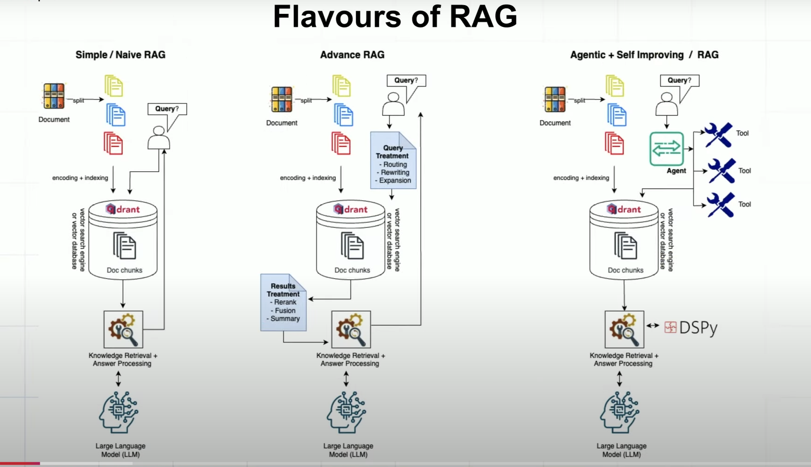
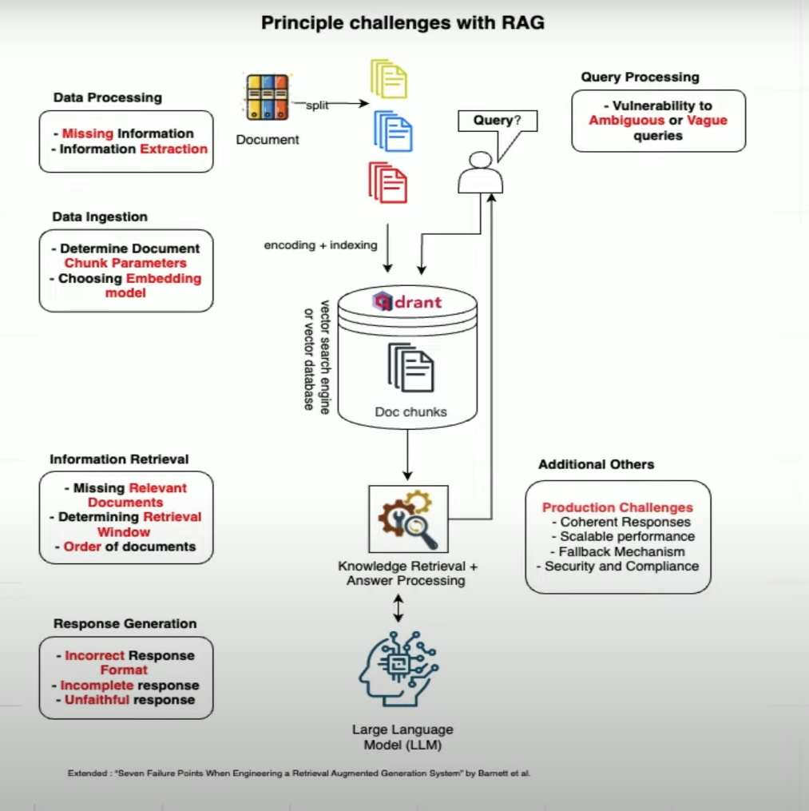
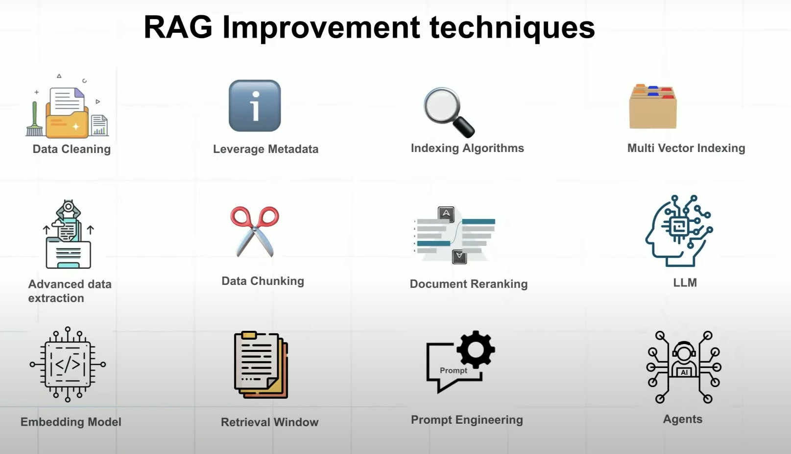
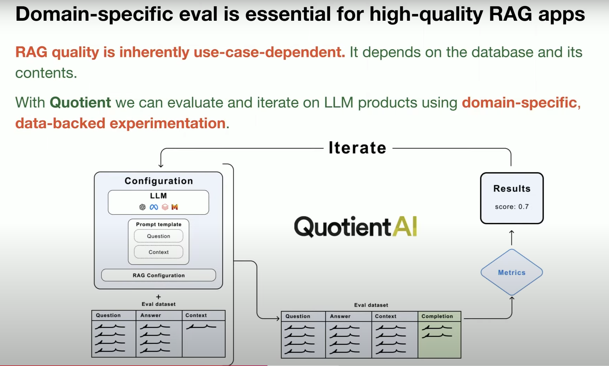
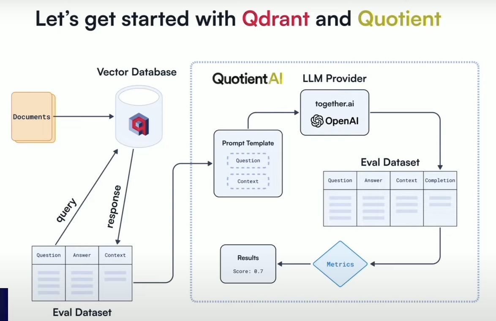

[Source Youtube](https://youtu.be/DId2KP8Ykz4?si=xuQ9Gr8-unz0mVZh)

1. ### **Challenges in RAG**
   - **Data Quality Issues**
     - Missing or improperly extracted information leading to incorrect or incomplete responses
   - **Chunking Strategy and Embedding Models**
     - Optimal chunking strategies and suitable embedding models tailored to specific domains
   - **Information Retrieval Challenges**
     - Determining document relevance, retrieval window size, and document ordering
     - Relevancy remains an unsolved problem in retrieval systems
   - **Response Generation Challenges**
     - Ensuring coherent and contextually accurate answers
     - Handling ambiguous or vague queries
   - **Scalability and Security**
     - Managing concurrent users
     - Ensuring data security and compliance

- Data processing
- Data ingestion
- Information retrieval
- Response generation
- Query processing
- Additionnal Others

1. ### **Optimization Techniques for RAG**
   - **Improving Data Quality**
     - Data cleaning and advanced extraction methodologies
     - Using domain-specific embedding models and metadata filtering
   - **Optimizing Chunking Strategies**
     - Reducing chunk size or implementing semantic chunking
   - **Reranking Retrieved Documents**
     - Utilizing different embedding models to rerank and filter out irrelevant documents
   - **Hybrid Search Approaches**
     - Combining dense and sparse vectors to capture domain-specific terminology
     - Integrating ranking models to enhance relevance and faithfulness
   - **Context Size Optimization**
     - Determining appropriate context size to balance information retrieval and noise

choose Embedding models that comprehense the terminology of our model
Data chunking -> reduce the chunk size or adding semantic chunking
indexing algorithms : hnsw bm25 or even graphs

Needs evaluation dataset with [Quotient AI](https://www.quotientai.co/post/building-high-quality-rag-applications-with-qdrant-and-quotient) 

The text in the image is:

For the evaluation, we will be considering the following metrics, with a focus on **Faithfulness**:
- Context Relevance
- Chunk Relevance
- Faithfulness
- ROUGE-L
- BERTScore
- BERT Sentence Similarity"

1. **Context Relevance (Pertinence du contexte)** :
   - Mesure la pertinence des documents récupérés par rapport à la question posée. Elle évalue si l’information nécessaire pour répondre à la question est présente dans le contexte.

2. **Chunk Relevance (Pertinence des morceaux)** :
   - Évalue la proportion d’informations utiles dans les morceaux de documents récupérés. Elle permet de déterminer si les informations extraites sont principalement pertinentes ou si elles contiennent du bruit.

3. **Faithfulness (Fidélité)** :
   - Indique si la réponse générée par le modèle est fidèle aux informations fournies. Une réponse fidèle ne contient pas de "hallucinations" (c'est-à-dire d'informations inventées) et respecte strictement le contenu du contexte.

4. **ROUGE-L** :
   - Mesure la similarité entre la réponse générée et une réponse de référence en se basant sur des correspondances de séquences de mots. ROUGE-L est souvent utilisé pour évaluer la qualité des résumés en vérifiant les chaînes de mots en commun.

5. **BERTScore** :
   - Utilise le modèle BERT pour évaluer la similarité entre la réponse générée et une réponse de référence à un niveau sémantique. Plutôt que de se baser sur des mots exacts, BERTScore évalue si les réponses sont similaires en sens.

6. **BERT Sentence Similarity (Similarité de phrases BERT)** :
   - Mesure la similarité entre la réponse générée et la réponse attendue en utilisant les embeddings de phrase de BERT. Cette métrique évalue la proximité sémantique entre les phrases, ce qui aide à vérifier si les réponses sont alignées en termes de sens global.

En résumé, **Context Relevance** et **Chunk Relevance** se concentrent sur la pertinence des informations récupérées, tandis que **Faithfulness** vérifie la fidélité de la réponse au contexte. **ROUGE-L** évalue la correspondance des mots, alors que **BERTScore** et **BERT Sentence Similarity** utilisent des modèles de langage pour une évaluation sémantique plus fine.