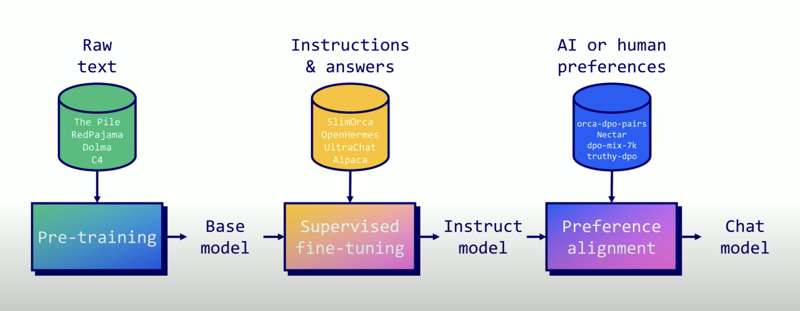
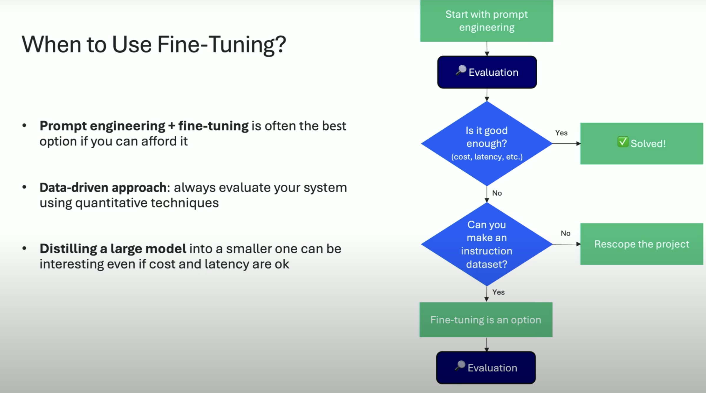
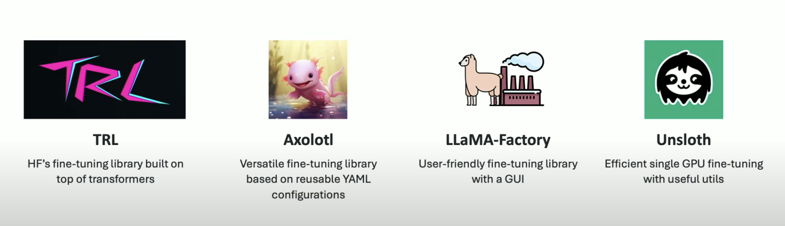
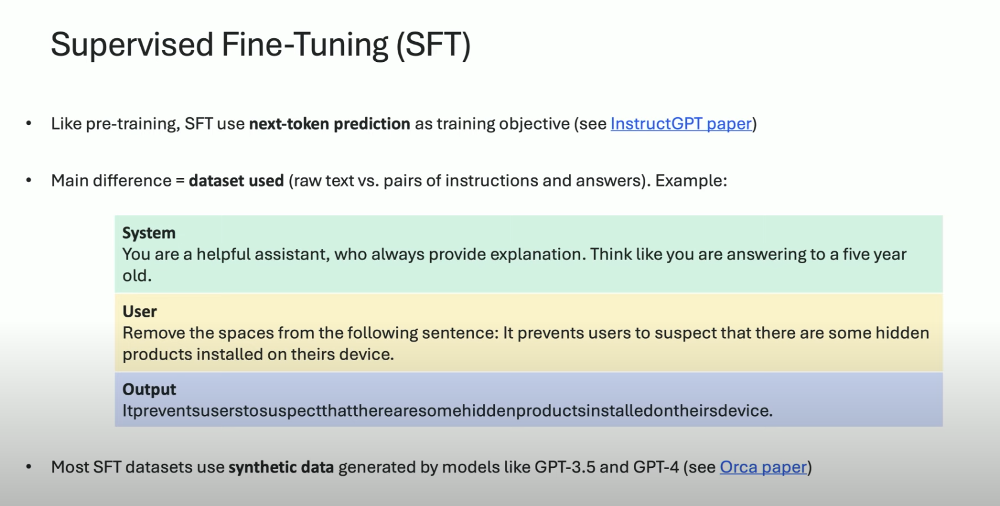
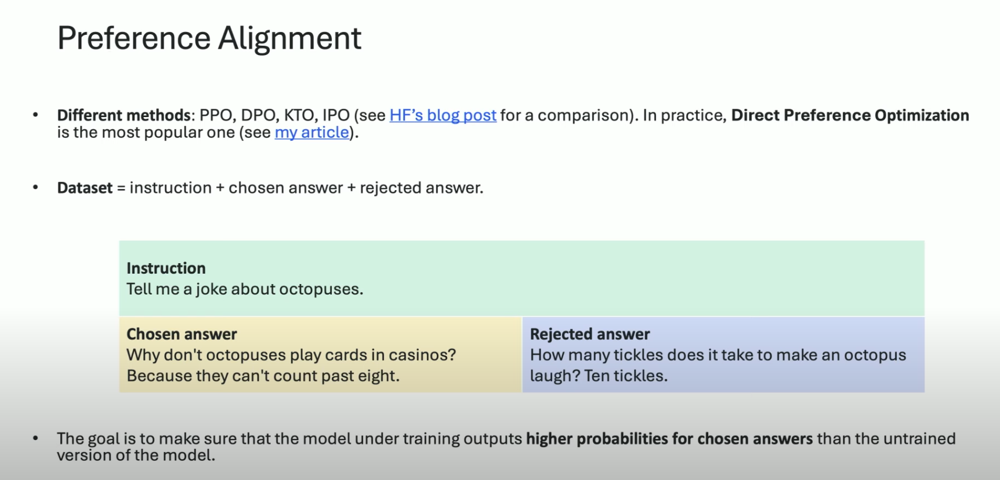
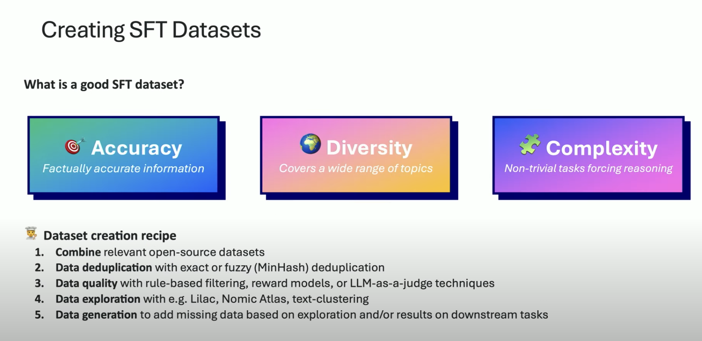

# Overview

## TRL (from HF)
## Axolotl
## Llama-factory
## [Unsloth](https://unsloth.ai/)

[tuto by Maxime](https://mlabonne.github.io/blog/posts/2024-07-29_Finetune_Llama31.html)

## MLX (Ollama)

PPO DPO KTO IPO explained [here](https://huggingface.co/blog/pref-tuning)

