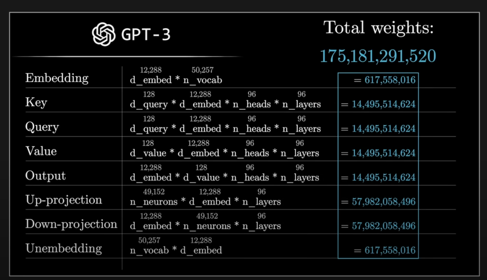

Breakdown of the total weights (parameters) in GPT-3, highlighting how the model's **175,181,291,520** parameters are distributed across different components of its architecture. Here’s a detailed explanation of each section:

1. **Embedding Layer**:
   - The embedding layer, responsible for converting input tokens into vectors, has **617,558,016** parameters.
   - Formula: $d_{embed} \times n_{{vocab}}$
     - $d_{{embed}} = 12,288$
     - $n_{{vocab}} = 50,257$

2. **Self-Attention Mechanism**:
   - The self-attention component is divided into **Key**, **Query**, **Value**, and **Output** matrices.
   - Each of these matrices has **14,495,514,624** parameters. This is repeated across **96 layers** with multiple heads, making the self-attention mechanism a large part of the model's parameter count.
   - The formula for each is:
     - Key/Query/Value: $d_{\text{query}} \times d_{\text{embed}} \times n_{\text{heads}} \times n_{\text{layers}}$
     - Output: $d_{\text{embed}} \times d_{\text{value}} \times n_{\text{heads}} \times n_{\text{layers}}$

3. **Feedforward Network (Up-projection and Down-projection)**:
   - The feedforward layer has two main parts: **Up-projection** (expanding the dimension) and **Down-projection** (reducing it back).
   - Each of these has **57,982,058,496** parameters, making them the largest components in the model.
   - Formula:
     - Up-projection: $n_{\text{neurons}} \times d_{\text{embed}} \times n_{\text{layers}}$
     - Down-projection: $d_{\text{embed}} \times n_{\text{neurons}} \times n_{\text{layers}}$

4. **Unembedding Layer**:
   - The unembedding layer, which maps the model’s output back to the vocabulary space, also has **617,558,016** parameters.
   - Formula: $n_{\text{vocab}} \times d_{\text{embed}}$

**Summary of Total Weights**:
   - The weights from each section add up to exactly **175,181,291,520**, confirming the model's parameter count. Each major component (Attention, Feedforward) contributes significantly, with the **Feedforward Network** being the largest, due to its dimensional projections.

## Embedding space

In GPT-3, the **embedding space** is a high-dimensional vector space where each token (word or subword unit) is represented by a dense vector. This space is defined by the **embedding dimension** of the model, which is **12,288** for GPT-3's largest version with 175 billion parameters.

### Key Details:

- **Dimension of Embedding Space**: 12,288. Each token is represented by a vector with 12,288 components, capturing various semantic and syntactic properties.
- **Vocabulary Size**: 50,257. GPT-3 uses Byte-Pair Encoding (BPE) to tokenize text, allowing for a large vocabulary size that includes common words, subwords, and symbols.
- **Embedding Layer Parameters**: The embedding layer has \( d_{\text{embed}} \times n_{\text{vocab}} = 12,288 \times 50,257 \), totaling **617,558,016 parameters**. These parameters are learned during training and define how tokens are mapped into the 12,288-dimensional space.

### Purpose of the Embedding Space

The embedding space is designed to capture nuanced relationships between tokens. Similar tokens (in terms of meaning or usage) are mapped to vectors that are close to each other in this high-dimensional space. This representation allows the model to leverage the rich structure of language, capturing associations and contextual similarities between words that it has learned from large-scale training data. 

In practice, each vector in the embedding space serves as the input for subsequent transformer layers, where further processing allows GPT-3 to generate coherent and contextually appropriate responses based on these embeddings.