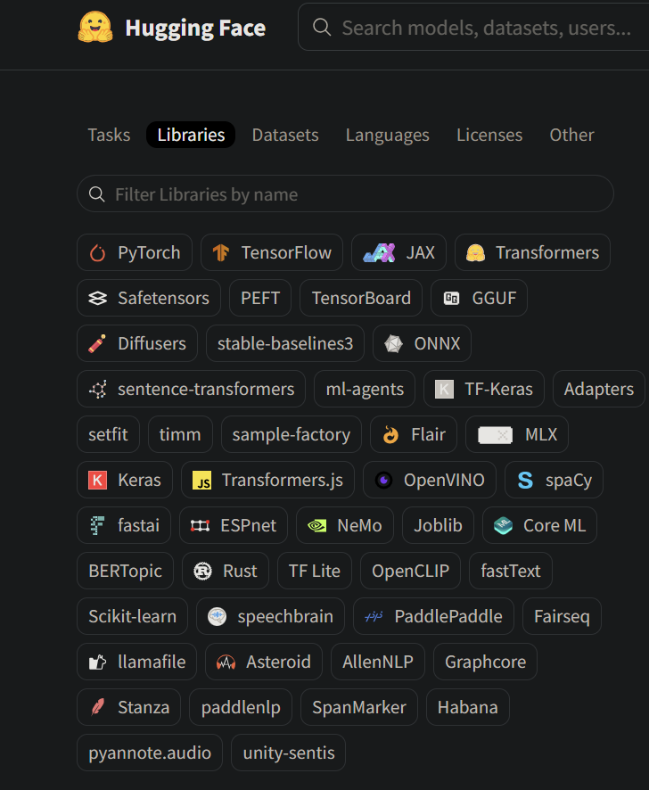

## Hugging Face

Frameworks d'apprentissage profond :

PyTorch, TensorFlow, JAX : Ce sont des frameworks majeurs utilisés pour construire et entraîner des modèles de machine learning.
Bibliothèques spécifiques à certaines tâches d'IA :

Transformers, sentence-transformers : Utilisées pour les modèles de traitement du langage naturel (NLP), notamment les architectures transformer.
Diffusers, stable-baselines3 : Liées aux modèles de génération (images, texte) et à l'apprentissage par renforcement.
timm (Torch Image Models), sample-factory : Outils pour les modèles d'images et l'apprentissage par renforcement.
Flair : Une bibliothèque pour le NLP (traitement du langage naturel).
Outils de manipulation de données et d'entraînement :

PEFT (parameter-efficient fine-tuning) : Pour affiner les modèles avec un usage efficace de la mémoire.
Safetensors : Format pour stocker des tensors de manière plus sécurisée et rapide.
TensorBoard : Visualisation des performances des modèles pendant l'entraînement.
ONNX : Format d'échange de modèles entre différents frameworks.
Outils pour des modèles spécialisés ou des accélérateurs matériels :

OpenVINO, GGUF, TensorBoard, ONNX : Pour faciliter l'export et l'exécution de modèles sur des infrastructures spécifiques (matériels dédiés).
Graphcore, Habana : Optimisés pour des architectures spécifiques de matériel d'IA.
Bibliothèques pour des tâches spécifiques :

spacy, flair, AllenNLP, Stanza : Pour le NLP (traitement de la langue naturelle).
fastText : Modèles de classification de texte rapides.
Asteroid, pyannote.audio : Pour le traitement du son/audio.
Outils pour l'entraînement distribué et optimisation :

ml-agents : Apprentissage par renforcement pour les agents dans des environnements virtuels.
fairseq, PaddlePaddle, fastai : Des bibliothèques pour former des modèles à grande échelle ou en parallèle.
Bibliothèques pour des frameworks multi-tâches ou des projets spécifiques :

Scikit-learn, Keras : Généralement utilisées pour les modèles plus traditionnels de machine learning ou deep learning.
SpeechBrain : Pour la reconnaissance vocale et d'autres tâches liées au son.

## Method

https://huggingface.co/arcee-ai/SuperNova-Medius-GGUF

    ollama run arcee-ai/SuperNova-Medius-GGUF

https://github.com/ollama/ollama/blob/5687f1a0cfa3d2408bfcb04f4342f657f6dada58/examples/jupyter-notebook/ollama.ipynb

## GGUF

Les librairies GGUF sur Hugging Face font référence à un nouveau format de modèles, appelé GGUF (GPTQ GGML Unified Format), qui a été développé pour unifier différents formats de modèles optimisés pour une utilisation plus efficace sur du matériel limité ou des dispositifs à faible consommation (comme des ordinateurs personnels ou des serveurs sans GPU puissant). Ce format est particulièrement adapté aux modèles d'IA tels que les grands modèles de langage (LLMs) et se concentre sur l'optimisation pour une exécution plus rapide tout en réduisant les exigences en matière de mémoire.

Objectif : GGUF est conçu pour unifier et simplifier les formats existants comme GGML et GPTQ, qui sont des techniques d'optimisation populaires pour des modèles comme LLaMA. GGML (Generalized Graphical Model Language) est utilisé pour exécuter des modèles sur CPU en réduisant leur taille (en utilisant des techniques comme la quantification), tandis que GPTQ est un autre type de compression des modèles basé sur la quantification pour les rendre plus petits et plus rapides à exécuter.
