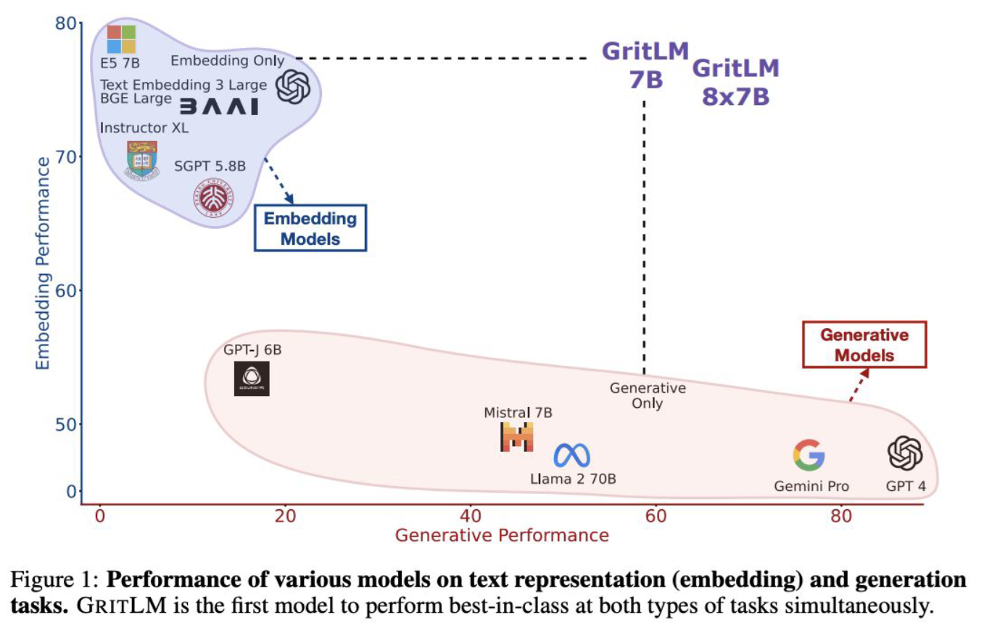

# Introduction

## 10 AI chip company Cerebras has filed to IPO

# Research

## 12 Gpt-4o

For example, GPT-4o outperforms Claude 3.5 Sonnet on MMLU, but apparently underperforms it on MMLU-Pro - a benchmark designed to be more challenging.

MMLU (Massive Multitask Language Understanding) est un benchmark conçu pour évaluer les modèles de langage sur leur capacité à comprendre et à raisonner à travers une grande variété de sujets académiques et professionnels. 

Il couvre plus de 57 sujets différents, allant de l’histoire à la physique, en passant par la médecine et les mathématiques. Les tâches sont conçues pour tester des compétences variées, comme la compréhension des concepts, la résolution de problèmes, et le raisonnement complexe. Les questions dans ce benchmark sont souvent de niveau universitaire ou professionnel.

## 13 Chain of thougt COT

o1 reasons through complex prompts step-by-step	
in a chain-of-thought (COT) style, employing RL to sharpen the COT and the strategies it uses	
    
AIME 2024 (competition math), with a	
whopping score of 83.83 versus 13.4.	
    
1M input tokens of	
o1-preview costs $15, while 1M output tokens will set you back $60. This	
makes it 3-4x more expensive than GPT-4o.	
    
[viral video of a PhD student reacting with astonishment](https://www.youtube.com/watch?v=M9YOO7N5jF8)

## 15 Llama 3

Llama 3.1 405B, their largest to-date, is able to hold its own against GPT-4o and Claude 3.5 Sonnet across reasoning, math, multilingual, and	
long-context tasks	
    
decoder-only transformer architecture	
    
GPT-4 : Environ 1,7 trillion de paramètres (estimation) et probablement autour de 10 à 15 trillions de tokens utilisés pour l'entraînement.
LLaMA 2 : Paramètres de 7B à 70B, entraînés sur 2 trillions de tokens.

Meta used an incredible 15T tokens to train the Llama 3 family	
    
Llama 3.1 405B was trained over 16,000 H100 GPUs, the first	Llama model trained at this scale.	
    
Meta followed up with Llama 3.2 in September, which	incorporated 11B and 90B VLMs (Llama’s multimodal debut).	

## 16 Meaning of Open Source

## 17 Dataset contamination

## 19 LMSYS Chatbot

The LMSYS Chatbot Arena Leaderboard has emerged as the community’s favorite method of formalizing evaluation by “vibes”. But as model performance improves, it’s beginning to produce counterintuitive results

## 20 Are neuro-symbolic systems making a comeback?

With AlphaGeometry, a symbolic deduction engine comes to the rescue
A Google DeepMind/NYU team generated millions of synthetic theorems and proofs using symbolic engines, using them to train a language model from scratch.

## 21 shrink models with minimal impact on performance

NVIDIA researchers took a more radical approach by pruning layers, neurons, attention heads, and embeddings, and then using knowledge distillation for efficient retraining.

## 22 distilled models become more fashionable

Andrej Karpathy and others have argued, current large model sizes could be a reflection of inefficient training.

To support these efforts, the community has started to produce open-source distillation tools, like arcee.ai’s DistillKit, which supports both Logit-based and Hidden states-based distillation

## 23 Models built for mobile compete with their larger peers

## 24 Quantization

## 25 REFT

Parameter-efficient fine-tuning (e.g. via LoRA) is nothing new, but Stanford researchers believe a more targeted approach offers greater efficiency and adaptation.

Inspired by model interpretability research, ReFT (Representation Fine-tuning) doesn’t alter the model’s weights. Instead, it manipulates the model’s internal representations at inference time to steer its behavior.

## 26 Hybrid models begin to gain traction

## 27 And could we distill transformers into hybrid models? It’s…complicated

MOHAWK is a new method for distilling knowledge from a large, pre-trained transformer model (teacher) to a smaller, subquadratic model (student) like a state-space model (SSM).

## 28 Reign of the transformers

## 29 Synthetic data starts gaining more widespread adoption…

Le concept de synthetic data (données synthétiques) dans ce contexte fait référence à des données générées artificiellement plutôt que collectées directement dans le monde réel. Ces données sont créées par des modèles d’intelligence artificielle ou par des algorithmes pour entraîner ou affiner d'autres modèles de machine learning. Les données synthétiques peuvent être utilisées pour simuler des scénarios ou des exemples qui pourraient manquer dans les données réelles, tout en offrant un contrôle plus précis sur la qualité et la diversité des données

## 30 Model Collapse

## 31 Web data is decanted openly at scale - proving quality is key

FineWeb, the dataset

## 32 Retrieval and embeddings hit the center stage

## 33 Context proves a crucial driver of performance

Traditional RAG solutions usually involve creating text snippets 256 tokens at a time with sliding windows (128	overlapping the prior chunk). This makes retrieval more efficient, but significantly less accurat	

Anthropic solved this using ‘contextual embeddings’, where a prompt instructs the model to generate text explaining the context of each chunk in the document
