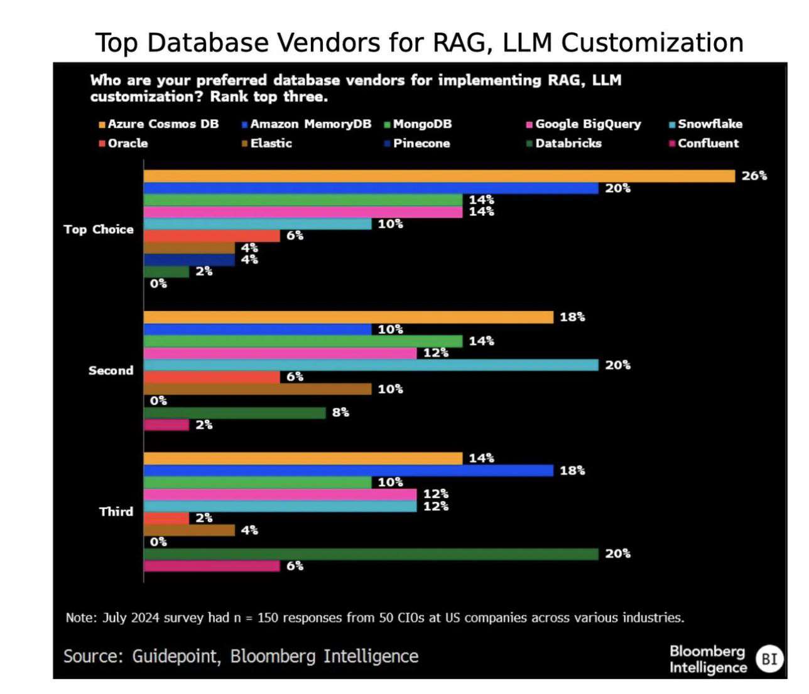

- [Introduction](#introduction)
  - [10 AI chip company Cerebras has filed to IPO](#10-ai-chip-company-cerebras-has-filed-to-ipo)
- [Research](#research)
  - [12 Gpt-4o](#12-gpt-4o)
  - [13 Chain of thougt COT](#13-chain-of-thougt-cot)
  - [15 Llama 3](#15-llama-3)
  - [16 Meaning of Open Source](#16-meaning-of-open-source)
  - [17 Dataset contamination](#17-dataset-contamination)
  - [19 LMSYS Chatbot](#19-lmsys-chatbot)
  - [20 Are neuro-symbolic systems making a comeback?](#20-are-neuro-symbolic-systems-making-a-comeback)
  - [21 shrink models with minimal impact on performance](#21-shrink-models-with-minimal-impact-on-performance)
  - [22 distilled models become more fashionable](#22-distilled-models-become-more-fashionable)
  - [23 Models built for mobile compete with their larger peers](#23-models-built-for-mobile-compete-with-their-larger-peers)
  - [24 Quantization](#24-quantization)
  - [25 REFT](#25-reft)
  - [26 Hybrid models begin to gain traction](#26-hybrid-models-begin-to-gain-traction)
  - [27 And could we distill transformers into hybrid models? It’s…complicated](#27-and-could-we-distill-transformers-into-hybrid-models-itscomplicated)
  - [28 Reign of the transformers](#28-reign-of-the-transformers)
  - [29 Synthetic data starts gaining more widespread adoption…](#29-synthetic-data-starts-gaining-more-widespread-adoption)
  - [30 Model Collapse](#30-model-collapse)
  - [31 Web data is decanted openly at scale - proving quality is key](#31-web-data-is-decanted-openly-at-scale---proving-quality-is-key)
  - [32 Retrieval and embeddings hit the center stage](#32-retrieval-and-embeddings-hit-the-center-stage)
  - [33 Context proves a crucial driver of performance](#33-context-proves-a-crucial-driver-of-performance)
  - [34 Evaluation for RAG remains unsolved](#34-evaluation-for-rag-remains-unsolved)
  - [35 Frontier labs face up to the realities of the power grid and work on mitigations](#35-frontier-labs-face-up-to-the-realities-of-the-power-grid-and-work-on-mitigations)
  - [36 Could better data curation methods reduce training compute requirements?](#36-could-better-data-curation-methods-reduce-training-compute-requirements)
  - [37 Chinese (V)LLMs storm the leaderboards despite sanctions](#37-chinese-vllms-storm-the-leaderboards-despite-sanctions)
- [industry](#industry)
  - [86 NVIDIA becomes the world’s most powerful company](#86-nvidia-becomes-the-worlds-most-powerful-company)
  - [87 Blackwell family of GPUs](#87-blackwell-family-of-gpus)
  - [Nvidia Amd Intel](#nvidia-amd-intel)
  - [92 H100](#92-h100)
  - [105 But where’s the revenue…?](#105-but-wheres-the-revenue)
  - [107 Meta Pivot](#107-meta-pivot)
  - [111 Chat agents as interactive developer sidekicks…](#111-chat-agents-as-interactive-developer-sidekicks)
  - [114 Is the ‘bring your own model’ era over?](#114-is-the-bring-your-own-model-era-over)
  - [117 Github reigns supreme, but an ecosystem of AI coding companies is growing](#117-github-reigns-supreme-but-an-ecosystem-of-ai-coding-companies-is-growing)
  - [118 ML tools for AI struggle (again)](#118-ml-tools-for-ai-struggle-again)
  - [119 Are AI agents going commercial?](#119-are-ai-agents-going-commercial)
  - [120 AI-powered search begins to make a dent, amid teething problems](#120-ai-powered-search-begins-to-make-a-dent-amid-teething-problems)
  - [145 Hot or not: smart glasses?](#145-hot-or-not-smart-glasses)
  - [152 Attention is all you need… to build raise billions for sell your AI start-up](#152-attention-is-all-you-need-to-build-raise-billions-for-sell-your-ai-start-up)
- [153 Politics](#153-politics)
- [174 Safety](#174-safety)
- [204 Predictions](#204-predictions)
- [glossaire](#glossaire)
  - [Glossaire\_CHOT](#glossaire_chot)
  - [Glossaire\_LMSYS](#glossaire_lmsys)
  - [Glossaire\_MMLU](#glossaire_mmlu)
  - [Decoder-only-transformer](#decoder-only-transformer)
  - [Neuro-symbolic-systems](#neuro-symbolic-systems)
  - [Fine Tuning vs Model distillation](#fine-tuning-vs-model-distillation)
    - [1. **Fine-tuning (Ajustement fin)**](#1-fine-tuning-ajustement-fin)
      - [Caractéristiques principales du fine-tuning :](#caractéristiques-principales-du-fine-tuning-)
      - [Avantages :](#avantages-)
    - [2. **Distillation de modèle (Model Distillation)**](#2-distillation-de-modèle-model-distillation)
      - [Caractéristiques principales de la distillation de modèle :](#caractéristiques-principales-de-la-distillation-de-modèle-)
      - [Avantages :](#avantages--1)
    - [Résumé des différences principales :](#résumé-des-différences-principales-)
    - [Exemple d'application des deux :](#exemple-dapplication-des-deux-)
  - [Representation\_fine-tuning](#representation_fine-tuning)

# Introduction

## 10 AI chip company Cerebras has filed to IPO

# Research

## 12 Gpt-4o

For example, GPT-4o outperforms Claude 3.5 Sonnet on [MMLU](#glossaire_mmlu), but apparently underperforms it on MMLU-Pro - a benchmark designed to be more challenging.

## 13 Chain of thougt COT

o1 reasons through complex prompts step-by-step	
in a [chain-of-thought (COT)](#glossaire_chot) style, employing RL to sharpen the COT and the strategies it uses	
    
AIME 2024 (competition math), with a whopping score of 83.83 versus 13.4.	
    
1M input tokens of o1-preview costs \$15, while 1M output tokens will set you back $60. This makes it 3-4x more expensive than GPT-4o.	
    
[viral video of a PhD student reacting with astonishment](https://www.youtube.com/watch?v=M9YOO7N5jF8)

## 15 Llama 3

Llama 3.1 405B, their largest to-date, is able to hold its own against GPT-4o and Claude 3.5 Sonnet across reasoning, math, multilingual, and long-context tasks

Les modèles LLaMA (Large Language Model Meta AI), développés par Meta (anciennement Facebook), sont basés sur une architecture [Decoder-only transformer](#decoder-only-transformer). Cela signifie qu'ils utilisent uniquement la partie décodeur du modèle Transformer pour la génération et la modélisation du langage.
    
GPT-4 : Environ 1,7 trillion de paramètres (estimation) et probablement autour de 10 à 15 trillions de tokens utilisés pour l'entraînement.
LLaMA 2 : Paramètres de 7B à 70B, entraînés sur 2 trillions de tokens.

Meta showcased open AI hardware designs, including the Catalina rack and the expanded Grand Teton platform, at the OCP Global Summit. Training the Llama 3.1 405B model required 16,000 NVIDIA H100 GPUs, highlighting Meta's scaling infrastructure. Open AI hardware systems are required to continue advancing AI capabilities.

Meta used an incredible 15T tokens to train the Llama 3 family	
    
Meta followed up with Llama 3.2 in September, which	incorporated 11B and 90B VLMs (Llama’s multimodal debut).	

## 16 Meaning of Open Source

## 17 Dataset contamination

## 19 LMSYS Chatbot

The [LMSYS](#glossaire_lmsys) Chatbot Arena Leaderboard has emerged as the community’s favorite method of formalizing evaluation by “vibes”. But as model performance improves, it’s beginning to produce counterintuitive results

## 20 Are [neuro-symbolic systems](#neuro-symbolic-systems) making a comeback?

With AlphaGeometry, a symbolic deduction engine comes to the rescue
A Google DeepMind/NYU team generated millions of synthetic theorems and proofs using symbolic engines, using them to train a language model from scratch.

## 21 shrink models with minimal impact on performance

NVIDIA researchers took a more radical approach by pruning layers, neurons, attention heads, and embeddings, and then using knowledge distillation for efficient retraining.

## 22 distilled models become more fashionable

Andrej Karpathy and others have argued, current large model sizes could be a reflection of inefficient training.

To support these efforts, the community has started to produce open-source distillation tools, like arcee.ai’s DistillKit, which supports both Logit-based and Hidden states-based distillation

## 23 Models built for mobile compete with their larger peers

## 24 Quantization

## 25 REFT

Parameter-efficient fine-tuning (e.g. via LoRA) is nothing new, but Stanford researchers believe a more targeted approach offers greater efficiency and adaptation.

Inspired by model interpretability research, [ReFT](#representation_fine-tuning) (Representation Fine-tuning) doesn’t alter the model’s weights. Instead, it manipulates the model’s internal representations at inference time to steer its behavior.

## 26 Hybrid models begin to gain traction

## 27 And could we distill transformers into hybrid models? It’s…complicated

MOHAWK is a new method for distilling knowledge from a large, pre-trained transformer model (teacher) to a smaller, subquadratic model (student) like a state-space model (SSM).

## 28 Reign of the transformers

## 29 Synthetic data starts gaining more widespread adoption…

Le concept de synthetic data (données synthétiques) dans ce contexte fait référence à des données générées artificiellement plutôt que collectées directement dans le monde réel. Ces données sont créées par des modèles d’intelligence artificielle ou par des algorithmes pour entraîner ou affiner d'autres modèles de machine learning. Les données synthétiques peuvent être utilisées pour simuler des scénarios ou des exemples qui pourraient manquer dans les données réelles, tout en offrant un contrôle plus précis sur la qualité et la diversité des données

## 30 Model Collapse

## 31 Web data is decanted openly at scale - proving quality is key

FineWeb, the dataset

## 32 Retrieval and embeddings hit the center stage

## 33 Context proves a crucial driver of performance

Traditional RAG solutions usually involve creating text snippets 256 tokens at a time with sliding windows (128	overlapping the prior chunk). This makes retrieval more efficient, but significantly less accurat	

Anthropic solved this using ‘contextual embeddings’, where a prompt instructs the model to generate text explaining the context of each chunk in the document

## 34 Evaluation for RAG remains unsolved

Researchers are now pioneering novel approaches, like Ragnarök, which introduces a novel web-based arena for human evaluation through pairwise system comparisons

## 35 Frontier labs face up to the realities of the power grid and work on mitigations

As compute clusters grow larger, they become harder to build and maintain. Clusters require high-bandwidth, low latency connections and are sensitive to device heterogeneity

Google DeepMind has proposed Distributed Low-Communication (DiLoCo), an optimization algorithm that allows training to occur on multiple loosely connected “islands” of devices

## 36 Could better data curation methods reduce training compute requirements?

Le paragraphe discute de la manière dont de meilleures méthodes de sélection des données pourraient réduire les besoins en calcul pour l'entraînement des modèles d'IA. Traditionnellement, l'ensemble des données est traité d'avance, sans ajustement au fur et à mesure de l'apprentissage. Cependant, Google DeepMind a développé **JEST**, qui sélectionne des lots entiers de données en fonction de leur pertinence (évaluée par un modèle de référence pré-entraîné) et adapte cette sélection tout au long de l'entraînement. JEST réduit également les coûts de calcul en utilisant des images à plus basse résolution tout en maintenant de bonnes performances.

## 37 Chinese (V)LLMs storm the leaderboards despite sanctions

Models produced by DeepSeek, 01.AI, Zhipu AI, and Alibaba have achieved strong spots on the [LMSYS](#glossairelmsys) leaderboard, displaying particularly impressive results in math and coding.

# industry

## 86 NVIDIA becomes the world’s most powerful company

## 87 Blackwell family of GPUs

L'H100 utilise l'architecture Hopper, succédant à l'architecture Ampère des GPU A100

The new Blackwell B200 GPU and GB200 Superchip promise significant performance gain over the Hopper architecture of H100 fame. NVIDIA claims it can reduce cost and energy consumption 25x over an H100

Jensen Huang has argued that every government needs to build its own LLM to preserve its national heritage

## Nvidia Amd Intel

A100 : Il offre des performances impressionnantes pour les tâches de calcul intensif. Par exemple, il propose jusqu'à 312 téraflops de performance en FP16 (virgule flottante 16 bits), très utile pour l'apprentissage profond.
H100 : Les performances sont largement supérieures, avec jusqu’à 1 pétaflop de performance en FP8 (un nouveau format introduit dans Hopper pour l'IA), ce qui représente une amélioration significative pour les modèles d’IA de grande tail

## 92 H100 

[Nvidia CEO hand-delivers world's fastest AI system to OpenAI, again — first DGX H200 given to Sam Altman and Greg Brockman](https://www.tomshardware.com/tech-industry/artificial-intelligence/nvidia-ceo-hand-delivers-worlds-fastest-ai-system-to-openai-again-first-dgx-h200-given-to-sam-altman-and-greg-brockman)

1x DGX GH200
Contains 256x GH200s (“Grace Hoppers”)
Each GH200 contains 1x H100 and 1x Grace CPU

## 105 But where’s the revenue…?

## 107 Meta Pivot

## 111 Chat agents as interactive developer sidekicks…

## 114 Is the ‘bring your own model’ era over?

In last year’s report, we touched on Databricks and Mosaic’s LLM combined strategy, which focused on
fine-tuning models on customer’s data. Is the ‘bring your own model’ era over?

The Mosaic research team, now folded into Databricks, open-sourced DBRX in March. A 132B MoE model,
DBRX was trained on just over 3,000 NVIDIA GPUs at a cost of $10M. Databricks is pitching the model as a
foundation for enterprises to build on and customize, while remaining in control of their own data.

## 117 Github reigns supreme, but an ecosystem of AI coding companies is growing

By far the most widely-used AI-powered developer tool, Copilot adoption is growing 180% year-over-year and its annual revenue run rate is now $2B (double its 2022 figure). Copilot (40% of Github revenue) alone is now a bigger business than Github was when Microsoft acquired it. However, it’s just one of a number of coding companies, some of which are raising blockbuster rounds.

## 118 ML tools for AI struggle (again)

## 119 Are AI agents going commercial?

Devin, launched by Cognition, made a splash in March. Pitched as “the first AI software engineer” 

## 120 AI-powered search begins to make a dent, amid teething problems

## 145 Hot or not: smart glasses?

## 152 Attention is all you need… to build raise billions for sell your AI start-up

Noam Shazeer of Character.ai sold his team back to Google for $2.5B, while Adept was acqui-hired into Amazon and Inflection into Microsoft for $650M. These deals all involved hiring founders and star employees while paying enough money to investors as a technology licensing fee to get the deals through.

Adept's $429m execuhire to Amazon

Inflection's $650m execuhire to Microsoft

Character.ai's $2.5b execuhire to Google today

Co-auteur d’une recherche fondamentale qui a donné le coup d’envoi du boom de l’intelligence artificielle, Noam Shazeer avait quitté Google en 2021 pour créer sa propre entreprise après que le géant de Mountain View eut refusé de lancer un chatbot qu’il avait mis au point. Lorsque la start-up, Character.AI, a commencé à échouer, son ancien employeur est intervenu.

# 153 Politics

# 174 Safety

# 204 Predictions

# glossaire

## Glossaire_CHOT
<a name="Glossaire_CHOT">CHOT dans balise<a>

## Glossaire_LMSYS

https://lmsys.org/ gives Elo Rating
New [web site](https://lmarena.ai/)

https://huggingface.co/spaces/lmarena-ai/chatbot-arena-leaderboard

<a name="GlossaireLMSYS">Lmsys dans balise<a>

## Glossaire_MMLU

MMLU (Massive Multitask Language Understanding) est un benchmark conçu pour évaluer les modèles de langage sur leur capacité à comprendre et à raisonner à travers une grande variété de sujets académiques et professionnels. 

Il couvre plus de 57 sujets différents, allant de l’histoire à la physique, en passant par la médecine et les mathématiques. Les tâches sont conçues pour tester des compétences variées, comme la compréhension des concepts, la résolution de problèmes, et le raisonnement complexe. Les questions dans ce benchmark sont souvent de niveau universitaire ou professionnel.

## Decoder-only-transformer 

L'architecture Transformer uniquement avec décodeur (ou "Decoder-only Transformer") est une variante du modèle Transformer utilisée principalement pour les tâches de génération de texte, comme dans des modèles de langage tels que GPT (Generative Pretrained Transformer).

Le Decoder-only Transformer est une architecture puissante, spécialisée pour les tâches de génération de texte et de prédiction séquentielle, utilisée dans des modèles comme GPT pour produire des séquences en se basant sur l'information contextuelle antérieure dans la séquence générée.

## Neuro-symbolic-systems

Les systèmes neuro-symboliques (en anglais, Neuro-Symbolic Systems) représentent une approche innovante en intelligence artificielle (IA) qui vise à combiner les forces des réseaux de neurones (apprentissage automatique, notamment le deep learning) avec celles de la représentation symbolique des connaissances (raisonnement symbolique). Cette intégration cherche à surmonter les limites de chaque approche lorsqu'elle est utilisée de manière isolée, visant à créer des systèmes d'IA plus robustes, explicables et capables de raisonnement abstrait

## Fine Tuning vs Model distillation

Le **fine-tuning** et la **distillation de modèle** (model distillation) sont deux techniques distinctes utilisées pour ajuster ou améliorer des modèles d'intelligence artificielle préexistants. Bien qu'ils visent tous deux à optimiser la performance des modèles, leurs méthodes et objectifs diffèrent significativement. Voici un aperçu des différences entre ces deux concepts :

### 1. **Fine-tuning (Ajustement fin)**
Le **fine-tuning** consiste à **adapter un modèle pré-entraîné** à une nouvelle tâche spécifique en **réentraînant** certaines de ses couches ou la totalité du modèle sur un jeu de données spécifique.

#### Caractéristiques principales du fine-tuning :
- **Point de départ** : Utilise un **modèle pré-entraîné** (généralement sur des données à grande échelle) comme base. Ce modèle a déjà appris des représentations générales.
- **But** : Affiner le modèle pour qu'il fonctionne bien sur une **tâche spécifique**. Par exemple, un modèle de langage général peut être affiné pour effectuer une tâche comme la classification de sentiments ou la génération de réponses dans un chatbot.
- **Méthode** : Le modèle est entraîné sur un **nouveau jeu de données** pertinent à la tâche cible, mais l'entraînement est souvent réalisé avec des taux d'apprentissage plus faibles que lors de l'entraînement initial pour ne pas effacer les représentations déjà apprises.
- **Personnalisation** : Permet d'ajuster un modèle pré-entraîné pour des cas d'utilisation spécialisés tout en tirant parti des connaissances générales du modèle initial.
- **Exemple** : Fine-tuning de GPT-3 sur un ensemble de questions médicales pour en faire un chatbot médical.

#### Avantages :
- **Moins coûteux** que l'entraînement d'un modèle depuis zéro, car il s'agit simplement d'adapter un modèle déjà performant.
- Peut être appliqué à **diverses tâches spécifiques** à partir du même modèle de base.

---

### 2. **Distillation de modèle (Model Distillation)**
La **distillation de modèle** consiste à **transférer les connaissances** d'un **modèle plus grand et plus complexe** (souvent appelé **"teacher" model**) vers un **modèle plus petit et plus simple** (appelé **"student" model**). L'objectif est de créer un modèle plus compact qui fonctionne presque aussi bien que le grand modèle, mais avec des exigences de calcul et de mémoire réduites.

#### Caractéristiques principales de la distillation de modèle :
- **Point de départ** : Un **modèle grand et puissant** est utilisé pour enseigner à un modèle plus petit.
- **But** : Créer un modèle plus **léger et plus efficace** qui conserve autant que possible les performances du modèle original tout en **réduisant les coûts de calcul** (taille, vitesse d'inférence, etc.).
- **Méthode** : Le **modèle plus petit** (student) est entraîné à imiter les **prédictions** du **modèle plus grand** (teacher), plutôt que d'être entraîné directement sur les données d'entraînement initiales. Cela se fait souvent en utilisant les **sorties adoucies** (soft labels) du modèle teacher (les probabilités prédictives) pour guider l'apprentissage du modèle student.
- **Exemple** : Distillation d'un modèle GPT-3 de 175B paramètres vers un modèle plus petit avec, par exemple, 1.3B paramètres pour permettre des déploiements plus efficaces tout en maintenant de bonnes performances.

#### Avantages :
- **Réduction significative des ressources** nécessaires (mémoire, vitesse d'inférence, puissance de calcul).
- Pratique pour déployer des modèles dans des environnements à **faibles ressources** ou pour des **applications temps réel** où un modèle rapide et léger est nécessaire.
- Permet de bénéficier des **connaissances** du modèle teacher sans nécessiter un modèle aussi grand et coûteux à l'exécution.

---

### Résumé des différences principales :

| Aspect                 | **Fine-tuning**                                      | **Distillation de modèle**                                |
|------------------------|------------------------------------------------------|-----------------------------------------------------------|
| **Objectif**            | Adapter un modèle à une tâche spécifique             | Réduire la taille d'un modèle tout en maintenant ses performances |
| **Modèle de départ**    | Un modèle pré-entraîné                               | Un grand modèle (teacher) qui enseigne un modèle plus petit (student) |
| **Données**             | Nécessite un nouveau jeu de données spécifique       | Utilise les prédictions du modèle teacher pour guider l'apprentissage |
| **Méthode**             | Réentraînement sur des données spécifiques           | Entraînement du modèle student pour imiter le modèle teacher |
| **Résultat**            | Modèle affiné pour une tâche précise                 | Modèle plus petit et plus rapide, proche du teacher en termes de performance |
| **Avantage principal**  | Amélioration des performances sur une tâche précise  | Réduction des coûts de calcul et de mémoire |

### Exemple d'application des deux :
- **Fine-tuning** : Un modèle GPT-3 peut être fine-tuné pour répondre à des questions juridiques spécifiques après avoir été pré-entraîné sur du texte général.
- **Distillation de modèle** : GPT-3 peut être distillé en un modèle plus petit (par exemple, de 175B à 1B paramètres) pour une utilisation dans des applications mobiles ou des environnements où les ressources sont limitées.

Ces deux techniques sont donc complémentaires : le **fine-tuning** permet d'adapter un modèle pour une tâche précise, tandis que la **distillation** permet de créer une version plus compacte et efficace d'un modèle complexe tout en préservant sa performance.

## Representation_fine-tuning

Le Representation Fine-Tuning (ReFT), ou « ajustement fin des représentations », est une méthode d’entraînement de modèles d'apprentissage automatique qui vise à améliorer la qualité des représentations internes du modèle en ajustant ses couches intermédiaires ou ses représentations pré-apprises pour une nouvelle tâche. Cela contraste avec l'entraînement traditionnel où on ajuste principalement les dernières couches d'un modèle pré-entraîné.

Contexte
Lorsqu'un modèle est pré-entraîné sur une tâche générale, comme la classification d'images ou la modélisation du langage, il apprend à représenter les données sous forme de vecteurs denses dans ses couches intermédiaires (appelées représentations latentes). Ces représentations contiennent de l'information utile pour de nombreuses tâches différentes. L'idée du ReFT est de prendre ces représentations pré-apprises et de les ajuster pour qu'elles deviennent plus adaptées à une tâche spécifique.

Différence avec Fine-tuning Classique
Dans un fine-tuning classique :

On prend un modèle pré-entraîné (par exemple, un modèle de vision entraîné sur ImageNet) et on ajuste uniquement ses couches finales pour s'adapter à une nouvelle tâche (par exemple, classifier des images de chiens et de chats).
On ne touche généralement pas aux représentations intermédiaires du modèle.